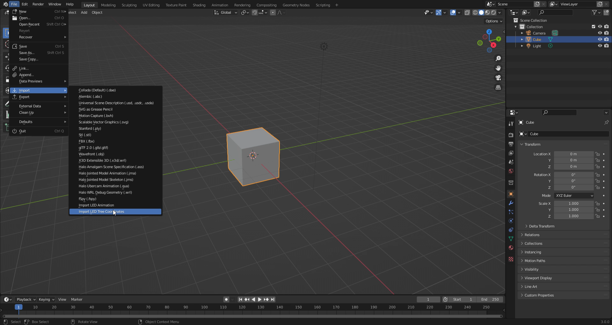
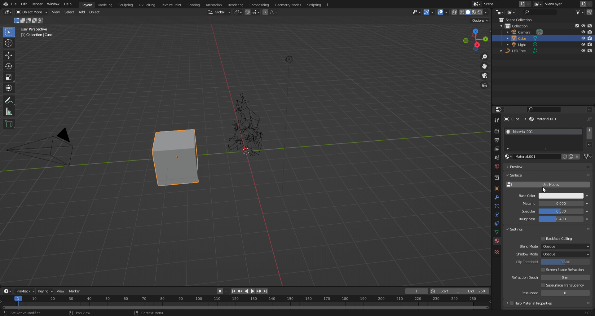
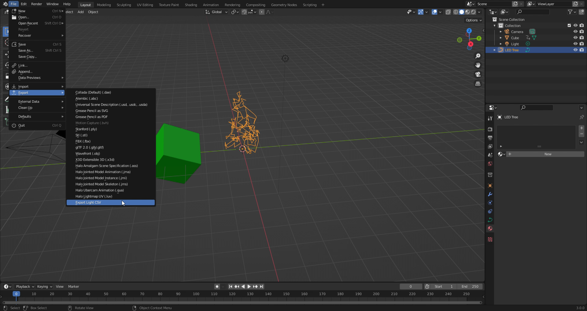
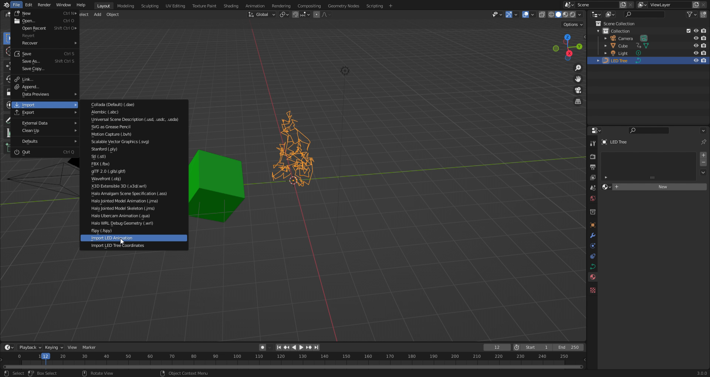

# LED Trees in Blender!

### _Thanks to [Rookirk](https://github.com/Rookirk) for advising me on script setup._

This Blender add-on allows you to import a .csv of light positions and use meshes in Blender to manipulate the colors of the lights. You can then export those colors as another .csv to use however you'd like (maybe to submit an [animation somewhere](https://www.youtube.com/watch?v=WuMRJf6B5Q4)?)

You can also re-import the .csv to see a preview of how the lights will be set up.

# How to Install

Step 1: Go to the [releases page](https://github.com/ambiguousname/ParkerTreeBlenderAddOn/releases), and download the latest .zip release.

Step 2: Open Blender

Step 3: Click Edit -> Preferences

Step 4: Click "Install"

Step 5: Click on the .zip file you saved

# How to import, animate, and export the LED tree

Step 1: Go to File -> Import -> Import LED Tree Coordinates

Step 2: Import the .csv file of values for your tree. [Here's this year's](https://www.dropbox.com/s/lmccfutftplhh3b/coords_2021.csv?dl=0).

Step 3: Create a mesh in the scene. Any mesh will do.

Step 4: Go to the materials tab for your mesh, click "New", then click "Use Nodes". You want nodes disabled so there's a clear color for the lights to pull from.

Step 5: Create and animate as many meshes as your heart desires. You may have to watch a tutorial for [animation in blender](https://youtu.be/LLIimJxTyNw) if you haven't already.

Step 6: Click on the christmas tree you imported.

Step 7: Go to File -> Export -> Export Light CSV

# How to preview your animations (or other people's animations)

Step 1: Import the LED Tree Coordinates if you haven't already.

Step 2: Click on the christmas tree you imported.

Step 3: Go to File -> Import -> Import LED Animation

Step 4: Wait.

Step 5: Hit space, and watch the animation!

# Questions you might have

**I want to be able to do fancy colors!**

Sorry, the way that the script is currently set up, you can't use Blender's shader nodes. However, the lights will average the colors of the objects they are currently inside of. Do with that what you will.

**The file didn't import/export properly!**

Most of the importing and exporting processes for this add-on require information about the tree's coordinates. Make sure you have those imported and SELECTED in blender before doing any other operations.

**Is this add-on restricted to trees?**
Absolutely. If you use this for anything else other than making bulbs on a tree change color, I will find you and devour you whole.

**There are some LEDs in the preview that turn on when they shouldn't!**
Sorry, that's probably something to do with the collision code messing up. Blender isn't exactly designed for this kind of thing, so I have yet to fix it. If you're really annoyed by it, let me know.